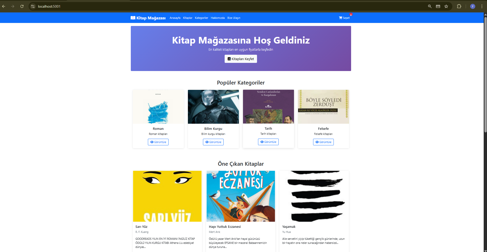
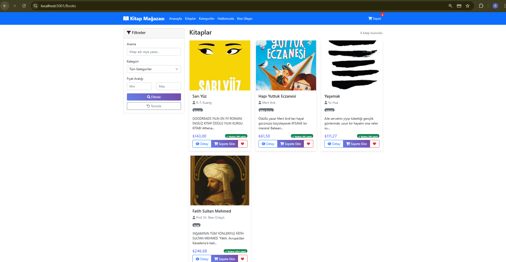
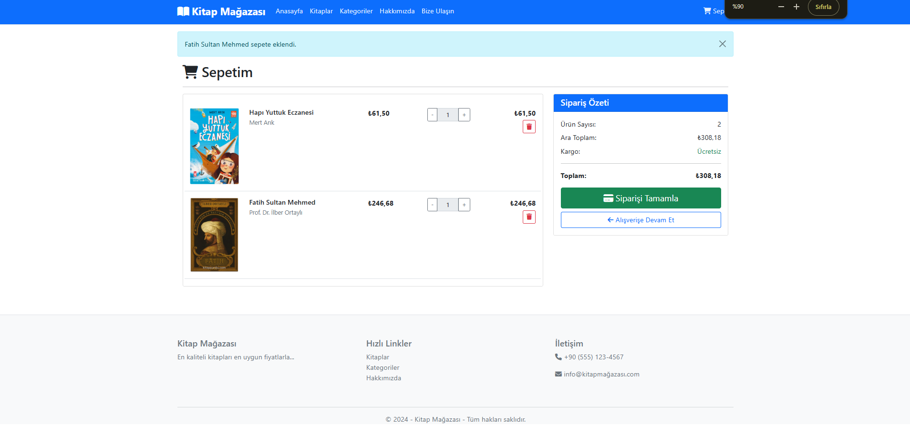
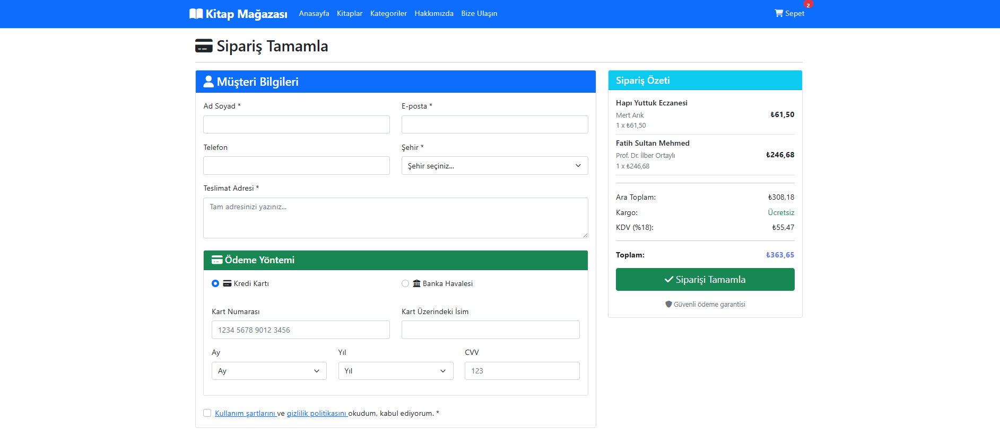

# 📚 Kitap Mağazası - Online Bookstore

Modern ve kullanıcı dostu bir online kitap mağazası uygulaması. ASP.NET Core Web API ve MVC mimarisi kullanılarak geliştirilmiştir.

## 📸 Proje Görselleri

### 🏠 Ana Sayfa


### 📚 Kitap Katalog Sayfası


### 🛒 Sepet


### 👨‍💼 Checkout


### 📱 Admin Dashboard


> 📁 **Daha fazla görsel için:** [/images](images/) klasörünü inceleyebilirsiniz.

## 🚀 Proje Özellikleri

### 🔧 Teknik Özellikler
- **Backend**: ASP.NET Core 8.0 Web API
- **Frontend**: ASP.NET Core MVC
- **Veritabanı**: Entity Framework Core (Code First)
- **Authentication**: Session-based Admin Panel
- **UI Framework**: Bootstrap 5
- **Icons**: Font Awesome 6
- **Architecture**: REST API + MVC Pattern

### 📋 Fonksiyonel Özellikler

#### 🛍️ Müşteri Özellikleri
- Kitap arama ve filtreleme
- Kategori bazlı görüntüleme
- Sepet yönetimi (Session)
- Favori kitaplar
- Sipariş tamamlama
- Responsive tasarım

#### 👨‍💼 Admin Özellikleri
- Kitap yönetimi (CRUD)
- Kategori yönetimi (CRUD)
- Sipariş takibi
- Resim upload
- Dashboard ve istatistikler

## 🎯 Projede Kullanılan Yaklaşımlar

### 🏗️ Mimari Yaklaşımlar

#### **1. Code First Yaklaşımı**
```csharp
// Entity Framework Code First ile model tanımlama
public class Book
{
    public int Id { get; set; }
    public string Title { get; set; }
    public string Author { get; set; }
    public decimal Price { get; set; }
    public virtual Category Category { get; set; }
}

// Migration ile veritabanı oluşturma
dotnet ef migrations add InitialCreate
dotnet ef database update
```

#### **2. REST API Yaklaşımı**
- RESTful endpoint tasarımı
- HTTP verb'lerinin doğru kullanımı (GET, POST, PUT, DELETE)
- JSON veri formatı
- Swagger/OpenAPI dokümantasyonu

```csharp
[Route("api/[controller]")]
[ApiController]
public class BooksController : ControllerBase
{
    [HttpGet]                           // GET /api/books
    [HttpGet("{id}")]                   // GET /api/books/5
    [HttpPost]                          // POST /api/books
    [HttpPut("{id}")]                   // PUT /api/books/5
    [HttpDelete("{id}")]                // DELETE /api/books/5
}
```

#### **3. MVC Pattern**
- Model-View-Controller ayrımı
- Separation of Concerns prensibi
- Business logic'in controller'da tutulması

### 🔄 Veri Aktarım Yaklaşımları

#### **ViewBag, ViewData, TempData Kullanımı**

```csharp
// ViewBag - Dynamic property
ViewBag.Categories = categories;
ViewBag.ErrorMessage = "Hata mesajı";

// ViewData - Dictionary-based
ViewData["Title"] = "Ana Sayfa";
ViewData["MetaDescription"] = "Kitap mağazası";

// TempData - Tek kullanımlık veri
TempData["SuccessMessage"] = "İşlem başarılı";
TempData["CartMessage"] = "Ürün sepete eklendi";
```

**Kullanım Alanları:**
- **ViewBag**: Kategori listeleri, hata mesajları, view'a özel veriler
- **ViewData**: Sayfa başlıkları, meta bilgiler, SEO verileri
- **TempData**: Başarı/hata mesajları, redirect sonrası bilgilendirmeler

#### **Session Yönetimi**
```csharp
// Sepet bilgilerini session'da tutma
HttpContext.Session.SetString("Cart", JsonSerializer.Serialize(cart));
var cartJson = HttpContext.Session.GetString("Cart");

// Admin oturumu
HttpContext.Session.SetString("IsAdmin", "true");
HttpContext.Session.SetString("AdminEmail", email);
```

### 🛡️ Güvenlik Yaklaşımları

#### **1. Input Validation**
```csharp
[Required]
[StringLength(200)]
public string Title { get; set; }

[Range(0.01, double.MaxValue)]
public decimal Price { get; set; }
```

#### **2. Anti-Forgery Token**
```html
<form method="post" asp-action="Create">
    @Html.AntiForgeryToken()
    <!-- Form fields -->
</form>
```

#### **3. File Upload Security**
```csharp
// Güvenli dosya upload
var allowedExtensions = new[] { ".jpg", ".jpeg", ".png", ".gif" };
var extension = Path.GetExtension(file.FileName).ToLowerInvariant();
if (!allowedExtensions.Contains(extension))
{
    return BadRequest("Geçersiz dosya formatı");
}
```

### 🔧 Performans Yaklaşımları

#### **1. Lazy Loading**
```csharp
public virtual Category Category { get; set; }  // Navigation property
```

#### **2. Circular Reference Handling**
```csharp
builder.Services.AddControllers()
    .AddJsonOptions(options =>
    {
        options.JsonSerializerOptions.ReferenceHandler = 
            System.Text.Json.Serialization.ReferenceHandler.IgnoreCycles;
    });
```

#### **3. DTO Pattern**
```csharp
// API için temiz veri transfer objesi
public class BookCreateDto
{
    public string Title { get; set; }
    public string Author { get; set; }
    public decimal Price { get; set; }
    public int CategoryId { get; set; }
}
```
### 🚀 Development Yaklaşımları

#### **1. Dependency Injection**
```csharp
// Service registration
builder.Services.AddHttpClient<ApiService>();
builder.Services.AddScoped<IBookService, BookService>();

// Constructor injection
public class BooksController : Controller
{
    private readonly ApiService _apiService;
    
    public BooksController(ApiService apiService)
    {
        _apiService = apiService;
    }
}
```

#### **2. Configuration Management**
```json
// appsettings.json
{
  "ApiSettings": {
    "BaseUrl": "https://localhost:7001/api"
  },
  "ConnectionStrings": {
    "DefaultConnection": "Server=..."
  }
}
```

#### **3. Error Handling**
```csharp
// Global error handling
try
{
    var result = await _apiService.CreateBookAsync(book);
    if (result != null)
    {
        TempData["SuccessMessage"] = "Kitap başarıyla eklendi.";
        return RedirectToAction("Books");
    }
}
catch (Exception ex)
{
    TempData["ErrorMessage"] = $"Hata: {ex.Message}";
    return View(book);
}
```

### 📡 API Communication Yaklaşımları

#### **1. HttpClient Usage**
```csharp
public class ApiService
{
    private readonly HttpClient _httpClient;
    
    public async Task<List<BookDto>> GetBooksAsync()
    {
        var response = await _httpClient.GetAsync($"{_baseUrl}/Books");
        if (response.IsSuccessStatusCode)
        {
            var json = await response.Content.ReadAsStringAsync();
            return JsonSerializer.Deserialize<List<BookDto>>(json);
        }
        return new List<BookDto>();
    }
}
```

#### **2. CORS Configuration**
```csharp
// API'de CORS ayarları
builder.Services.AddCors(options =>
{
    options.AddPolicy("AllowAll", policy =>
    {
        policy.AllowAnyOrigin()
              .AllowAnyMethod()
              .AllowAnyHeader();
    });
});
```

### 🗄️ Database Yaklaşımları

#### **1. Entity Relationships**
```csharp
// One-to-Many relationship
modelBuilder.Entity<Book>()
    .HasOne(b => b.Category)
    .WithMany(c => c.Books)
    .HasForeignKey(b => b.CategoryId);

// Many-to-Many relationship (Favorites)
modelBuilder.Entity<Favorite>()
    .HasOne(f => f.User)
    .WithMany(u => u.Favorites)
    .HasForeignKey(f => f.UserId);
```

#### **2. Data Seeding**
```csharp
// Program.cs'te seed data
if (!context.Categories.Any())
{
    var categories = new[]
    {
        new Category { Name = "Roman", Description = "Roman kitapları" },
        new Category { Name = "Bilim Kurgu", Description = "Bilim kurgu kitapları" }
    };
    
    context.Categories.AddRange(categories);
    await context.SaveChangesAsync();
}
```

## 🏗️ Proje Yapısı

```
BookStore/
├── BookStoreAPI/                 # REST API Projesi
│   ├── Controllers/
│   │   ├── BooksController.cs
│   │   ├── CategoriesController.cs
│   │   ├── OrdersController.cs
│   │   └── TestController.cs
│   ├── Models/
│   │   ├── User.cs
│   │   ├── Category.cs
│   │   ├── Book.cs
│   │   ├── Order.cs
│   │   ├── OrderItem.cs
│   │   └── Favorite.cs
│   ├── DTOs/
│   │   ├── BookCreateDto.cs
│   │   └── OrderCreateDto.cs
│   ├── Data/
│   │   └── BookStoreDbContext.cs
│   └── Program.cs
│
├── BookStoreMVC/                 # MVC Web Uygulaması
│   ├── Controllers/
│   │   ├── HomeController.cs
│   │   ├── BooksController.cs
│   │   ├── CategoriesController.cs
│   │   └── AdminController.cs
│   ├── Models/
│   │   ├── BookDto.cs
│   │   ├── CategoryDto.cs
│   │   ├── Cart.cs
│   │   └── CartItem.cs
│   ├── Services/
│   │   └── ApiService.cs
│   ├── Views/
│   │   ├── Shared/
│   │   ├── Home/
│   │   ├── Books/
│   │   ├── Categories/
│   │   └── Admin/
│   └── wwwroot/
│       ├── css/
│       ├── js/
│       └── images/
```

## 🛠️ Kurulum ve Çalıştırma

### Gereksinimler
- .NET 8.0 SDK
- SQL Server LocalDB
- Visual Studio 2022 veya VS Code

### 1. Projeyi İndirin
```bash
git clone <repository-url>
cd BookStore
```

### 2. API Projesini Ayarlayın
```bash
cd BookStoreAPI

# Gerekli paketleri yükleyin
dotnet restore

# Veritabanını oluşturun
dotnet ef migrations add InitialCreate
dotnet ef database update

# API'yi çalıştırın
dotnet run --urls="https://localhost:7001"
```

### 3. MVC Projesini Ayarlayın
```bash
cd BookStoreMVC

# Gerekli paketleri yükleyin
dotnet restore

# Resim klasörlerini oluşturun
mkdir wwwroot/images/books
mkdir wwwroot/images/categories

# MVC uygulamasını çalıştırın
dotnet run --urls="https://localhost:5001"
```

## 🌐 Uygulama URL'leri

- **Ana Site**: https://localhost:5001
- **API Swagger**: https://localhost:7001
- **Admin Panel**: https://localhost:5001/Admin/Login

### 🔐 Admin Giriş Bilgileri
- **Email**: admin@bookstore.com
- **Şifre**: admin123

## 📊 Veritabanı Şeması

### Tablolar
1. **Users** - Kullanıcı bilgileri
2. **Categories** - Kitap kategorileri
3. **Books** - Kitap bilgileri
4. **Orders** - Sipariş bilgileri
5. **OrderItems** - Sipariş detayları
6. **Favorites** - Favori kitaplar

### İlişkiler
- User → Orders (1:N)
- User → Favorites (1:N)
- Category → Books (1:N)
- Book → OrderItems (1:N)
- Book → Favorites (1:N)
- Order → OrderItems (1:N)

## 🎯 API Endpoints

### Books
- `GET /api/books` - Tüm kitaplar
- `GET /api/books/{id}` - Kitap detayı
- `GET /api/books/category/{categoryId}` - Kategoriye göre kitaplar
- `POST /api/books/create` - Yeni kitap (DTO)
- `PUT /api/books/{id}` - Kitap güncelle
- `DELETE /api/books/{id}` - Kitap sil

### Categories
- `GET /api/categories` - Tüm kategoriler
- `GET /api/categories/{id}` - Kategori detayı
- `POST /api/categories` - Yeni kategori
- `PUT /api/categories/{id}` - Kategori güncelle
- `DELETE /api/categories/{id}` - Kategori sil

### Orders
- `GET /api/orders` - Tüm siparişler
- `GET /api/orders/{id}` - Sipariş detayı
- `POST /api/orders` - Yeni sipariş
- `PUT /api/orders/{id}/status` - Sipariş durumu güncelle

### Test
- `GET /api/test/health` - API sağlık kontrolü
- `GET /api/test/database` - Veritabanı bağlantı kontrolü

## 🎨 Kullanılan Teknolojiler

### Backend
- ASP.NET Core 8.0
- Entity Framework Core
- SQL Server
- Swagger/OpenAPI

### Frontend
- HTML5, CSS3, JavaScript
- Bootstrap 5
- jQuery
- Font Awesome

### Development
- Visual Studio 2022
- Git

## 📱 Responsive Tasarım

Uygulama tüm cihazlarda mükemmel görünüm sağlar:
- 📱 Mobil cihazlar
- 📲 Tablet cihazlar
- 💻 Desktop bilgisayarlar

## 🔄 Önemli Özellikler

### ViewBag, ViewData, TempData Kullanımı
- **ViewBag**: Kategori listesi, hata mesajları
- **ViewData**: Sayfa başlıkları, meta bilgiler
- **TempData**: Başarı/hata mesajları, bilgilendirmeler

### Session Yönetimi
- Sepet bilgileri
- Favori kitaplar
- Admin oturumu

### Resim Upload
- Güvenli dosya yükleme
- Otomatik dosya adlandırma
- Eski dosya temizleme

### Error Handling
- Global hata yakalama
- Kullanıcı dostu hata mesajları
- API hata yönetimi

## 👨‍💻 Geliştiriciler

- **Geliştirici**: Yiğit Ali Sunal
- **Email**: yigitalisunal03@gmail.com
- **LinkedIn**: https://www.linkedin.com/in/yigitpy03/

---

**⭐ Bu projeyi beğendiyseniz yıldız vermeyi unutmayın!**
